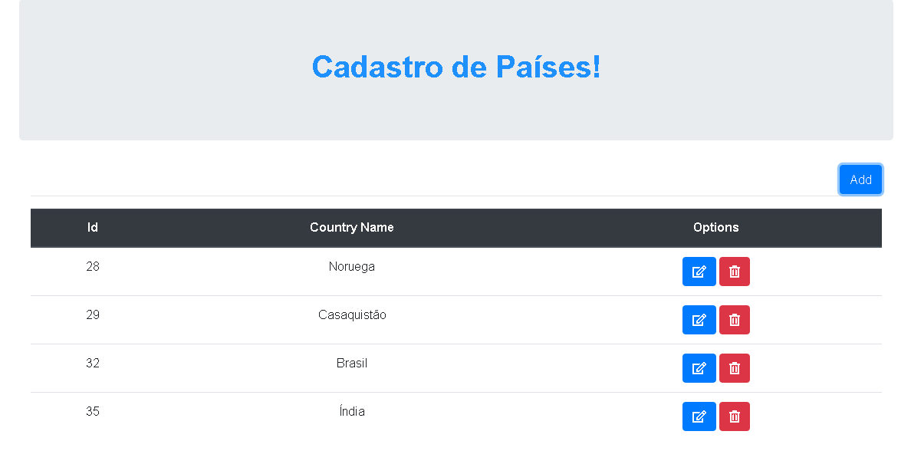
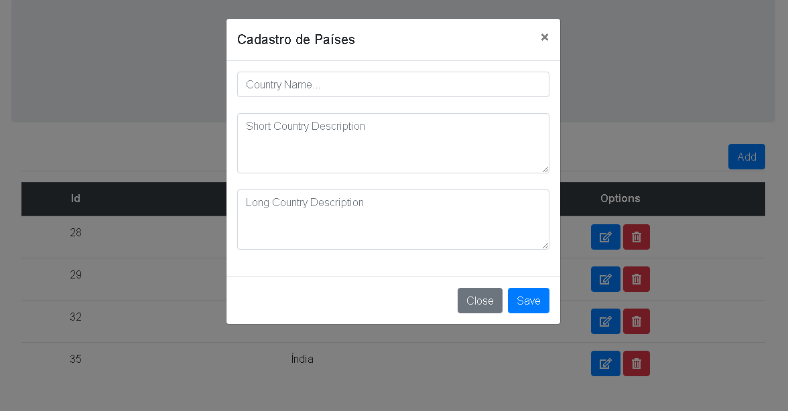

# Projeto CRUD com Ajax.

Desenvolvimento de uma aplicação web - CRUD (cadastro de Países e Descrição).

## Tecnologias Utilizadas:

- Javascript
- Biblioteca jQuery
- Ajax
- PHP
- MySQL
- Bootstrap

## Descrição do Projeto:

Este projeto teve com objetivo desenvolver um sistema utilizando a biblioteca jQUery para realizar e demonstrar o funcionamento e a estrutura de uma Aplicação Web com requisições via Ajax.

Esta aplicação realiza o cadastro de um país qualquer, com dois tipos de descrições, "curta" e "longa", e lista todos os países já cadastrados para o usuário na tela pincipal. O cadastro é realizado por meio de um formulário modal, o qual agiliza o cadastro, permitindo-o que seja realizado na mesma tela de listagem.

Utilizou-se: 

- O MySql para o gerenciamento do banco de dados.
- Framework Bootstrap para realização de um layout responsivo para o projeto.

## Configuração do Projeto:

- Será necessário criar o banco de dados manualmente, seguindo o modelo de nomeclatura dos parâmetros a seguir:

```

  $hostname = "localhost";
  $user = "root";
  $password = "";
  $database = "mysqlDataManager";

```

```

Nome da tabela -> country.
Com 4 colunas:
  - id
  - countryName
  - shortDesc
  - longDesc
  
```

## Imagens da Aplicação:

<p align="center">
  
  
</p>
